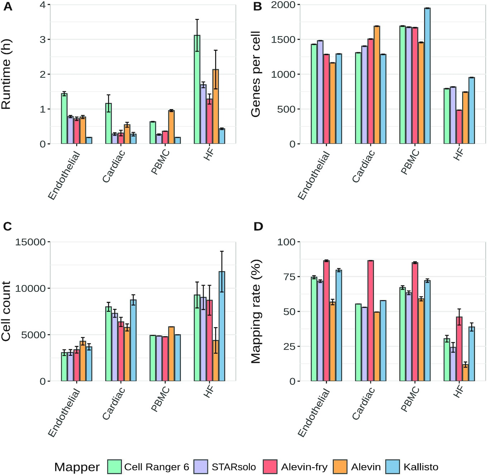

# Table of Contents <!-- omit in toc -->

- [Introduction](#introduction)
- [Motivation](#motivation)
- [Discussion](#discussion)
- [Specification](#specification)

# Introduction

This RFC lays out the specification for the scRNA-Seq mapping pipeline.

# Motivation

To provide the  community access to data from scRNA-Seq experiments performed at St. Jude Children's Research Hospital, we propose the following data harmonization pipeline. The goal of this pipeline is to provide harmonized alignments for scRNA-Seq data. For this pipeline, we will make no recommendations on downstream analysis, focusing instead on harmonizing the underlying sequencing data and leaving analysis decisions to the user.

# Discussion

The development of bulk RNA-Seq enabled efficient profiling of transcripts in a sample. The ability to interrogate the transcriptome in an unbiased manner, largely replaced previous methods such as microarrays or RT-qPCR. A bulk RNA-Seq experiment sample is a mixture of cells. This method is useful for analyses such as comparing expression between tumor and normal samples. However, this limits the analysis to the average expression over a population of cells and is unable to capture the heterogeneity of gene expression across individual cells. Newer methods have enabled RNA-Seq to be applied to single cells. This enables new questions about cell-specific transcriptome changes. This methodology has been employed in large projects such as the [Human Cell Atlas](https://www.humancellatlas.org/) to capture the cellular diversity within organisms.

## scRNA-Seq methodology

Generally, scRNA-Seq differs somewhat from bulk RNA-Seq. Most approaches generate three key pieces of information: 1. cDNA fragment from the RNA transcript, 2. a cell barcode that identifies in which cell the RNA was expressed, and 3. a unique molecular identifier (UMI) to enable collapse of PCR duplicates.

There are several commerical options for performing scRNA-Seq. One such option is the 10x Chromium platform. In their approach using paired-end reads, the celluar barcode and UMI are found in read 1 and the transcript sequence is found in read 2. The 10x method is the most popular commercially available method, so handling data for that platform will be the priority.

The canonical tool for processing 10x Chromium scRNA-Seq data is their [Cell Ranger](https://support.10xgenomics.com/single-cell-gene-expression/software/pipelines/latest/what-is-cell-ranger) tool. This tool uses STAR to perform alignment. It then uses the transcriptome annotation GTF to label reads as exonic, intronic, or intergenic. It then performs some additional refinement on the alignments to determine which reads are transcriptomic. These reads are then carried into UMI counting. The UMI counting step produces a raw gene by cell matrix of counts.

## Processing Pipeline

For processing of bulk RNA-Seq data, a common standard workflow is to align against the genome using [STAR](https://github.com/alexdobin/STAR). Quantification is then done using a package such as [HTSeq-count](https://htseq.readthedocs.io/en/release_0.11.1/count.html). An example of a bulk RNA-Seq pipeline is the [St. Jude Cloud RNA-Seq standard workflow v2.0.0](0001-rnaseq-workflow-v2.0.0.md).

### Aligner choice

For consistency with other St. Jude Cloud datasets, we are not considering psuedoalignment methods such as [kallisto](https://www.kallistobus.tools/) and [Alevin](https://salmon.readthedocs.io/en/latest/alevin.html). This leaves the previously described Cell Ranger method and STARsolo as the primary candidates for use in St. Jude Cloud.

[Bruning, et. al.](https://doi.org/10.1093/gigascience/giac001) (2022) provide a useful comparison of commonly used scRNA-Seq methods. However due to our preference for an alignment-based method, we will choose between Cell Ranger and STARsolo. Cell Ranger is the most commonly used method for processing data generated from the 10x protocol. Downstream analysis tools have been developed to directly ingest data in the formats produced by Cell Ranger. The tool is an integrated system that performs alignment, feature counting, and quality control.



### Quantification choice

Quantification is a product of both the Cell Ranger and STARsolo packages. Quantification could also be accomplished using a pseudoalignment method, such as Kallisto or Alevin, if there was no desire to share the raw data in BAM format. However that would be a departure from the normal St. Jude Cloud methodology, so that will not be discussed here. Therefore, there is no additional quantification choice to be made beyond that of the aligner package.

Using either STARsolo or Cell Ranger for analysis requires selection of reference files. For the genome, we will continue using GRCh38_no_alt. The transcript annotation GTF is more complicated. 10x [provides](https://support.10xgenomics.com/single-cell-gene-expression/software/downloads/latest) several versions of the annotation files used in Cell Ranger. For simplicity, we will use the Cell Ranger reference files version 2020-A which incorporates GENCODE v32.

# Specification

## Dependencies

## Reference files

The following reference files are used as the basis of the scRNA-Seq Workflow v1.0.0:

- We will use the 10x provided reference files version 2020-A. You can get the file by running the following commands:

  ```bash
  wget https://cf.10xgenomics.com/supp/cell-exp/refdata-gex-GRCh38-2020-A.tar.gz -O 10x-GRCh38-2020-A.tar.gz

  echo "dfd654de39bff23917471e7fcc7a00cd  10x-GRCh38-2020-A.tar.gz" > 10x-GRCh38-2020-A.tar.gz.md5
  md5sum -c 10x-GRCh38-2020-A.tar.gz.md5
  # > 10x-GRCh38-2020-A.tar.gz: OK

  tar -zxf 10x-GRCh38-2020-A.tar.gz
  mv refdata-gex-GRCh38-2020-A 10x-GRCh38-2020-A
  ```

## Workflow

Here are the resulting steps in the scRNA-Seq Workflow v1.0.0 pipeline. There might be slight alterations in the actual implementation, which can be found in [the St. Jude Cloud workflows repository](https://github.com/stjudecloud/workflows/blob/master/workflows/scrnaseq/scrnaseq-standard.wdl).

1. Run `picard ValidateSam` on the incoming BAM to ensure that it is well-formed enough to convert back to FastQ.

   ```bash
   picard ValidateSamFile I=$INPUT_BAM \                # Input BAM.
                     IGNORE=INVALID_PLATFORM_VALUE \    # Validations to ignore.
                     IGNORE=MISSING_PLATFORM_VALUE
   ```

2. Split BAM file into multiple BAMs on the different read groups using `samtools split`. See [the samtools documentation](http://www.htslib.org/doc/samtools.html) for more information.

   ```bash
   samtools split -u $UNACCOUNTED_BAM_NAME \ # Reads that do not belong to a read group or the read group is unrecognized go here.
                  -f '%*_%!.%.'              # Format of output BAM file names.
   ```

   If the BAM has unaccounted reads, those will need to be triaged and this step will need to be rerun.

3. Run Picard `SamToFastq` on each of the BAMs generated in the previous step.

   ```bash
      picard SamToFastq \
             INPUT=$INPUT_BAM \
             FASTQ=$FASTQ_R1 \
             SECOND_END_FASTQ=$FASTQ_R2 \
             RE_REVERSE=true \
             VALIDATION_STRINGENCY=SILENT
   ```

4. Run `fq lint` on each of the FastQ pairs that was generated in the previous step as a sanity check. You can see the checks that the `fq` tool performs [here](https://github.com/stjude/fqlib/blob/master/README.md#validators).

   ```bash
   fq lint $FASTQ_R1 $FASTQ_R2 # Files for read 1 and read 2.
   ```

5. Run `Cell Ranger`.

   ```bash
        cellranger count \
                   --id=$OUTPUT_DIR_NAME \      # A unique run id and output folder name [a-zA-Z0-9_-]+
                   --transcriptome=$REFERENCE \ # Path of folder containing 10x-compatible transcriptome reference
                   --fastqs=$FASTQ_DIR \        # Path to input FASTQ data
                   --sample=$FASTQ_PREFIX \     # Prefix of the filenames of FASTQs to select
                   --localcores=$N_CORES \      # Maximum number of cores to use
                   --localmem=$MEM_GB           # Maximum memory (GB) to use
   ```

6. Run `picard ValidateSamFile` on the aligned and sorted BAM file.

   ```bash
   picard ValidateSamFile \
                  I=$CELL_RANGER_SORTED_BAM \     # Cell Ranger-aligned, coordinate-sorted BAM.
                  IGNORE=INVALID_PLATFORM_VALUE \ # Validations to ignore.
                  IGNORE=MISSING_PLATFORM_VALUE
   ```

7. Run `ngsderive`'s `strandedness` subcommand to confirm that the lab's information on strandedness reflects what was is computed. Manually triage any discrepancies. This is particularly useful for historical samples. Additionally,
if the value for strandedness isn't known at run time, we can use the inferred value (if reported).

   ```bash
   ngsderive strandedness $CELL_RANGER_SORTED_BAM \  # Cell Ranger-aligned, coordinate-sorted BAM.
                          -g $GENCODE_GTF_V32_GZ     # GENCODE v32 GTF (gzipped)
   ```
