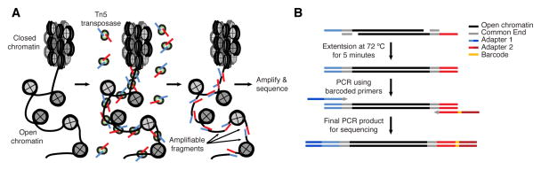

# ATAC-Seq Pipeline <!-- omit in toc -->

- [Introduction](#introduction)
- [Motivation](#motivation)
- [Discussion](#discussion)
- [Specification](#specification)
- [Further Reading](#further-reading)
- [References](#references)

# Introduction

This RFC lays out the specification for the ATAC-Seq mapping pipeline. 

# Motivation

To provide the  community access to data from ATAC-Seq experiments performed at St. Jude Children's Research Hospital, we propose the following data harmonization pipeline. The goal of this pipeline is to provide harmonized alignments for ATAC-Seq data. For this pipeline, we will make no recommendations on downstream analysis, focusing instead on harmonizing the underlying sequencing data and leaving analysis decisions to the user.

# Discussion

ATAC-Seq (Assay for Transposase-Accessible Chromatin using Sequencing) investigates chromatin accessibility regions in the genome, similar to earlier techniques such as DNase-seq, MNase-seq, or FAIRE-seq. This high-throughput sequencing technique offers a powerful method to investigate genome-wide chromatin accessibility and regulatory elements.

The ATAC-Seq protocol introduces a genetically engineered Tn5 transposase. Tn5 cuts open chromatin and then ligates sequencing adapters to these regions. While doing this, the Tn5 occupies a 9bp region leading to an offset of 4bp on the positive strand and 5bp on the negative strand.[1](https://www.ncbi.nlm.nih.gov/pmc/articles/PMC8191135) In order to identify the center of the interaction locus, the reads will need to be shifted to account for this gap.

 [2](https://www.ncbi.nlm.nih.gov/pmc/articles/PMC4374986/)

ATAC-Seq libraries are prone to contamination with mitochondrial DNA, typical analyses ignore or remove reads from mitochondria. In addition, duplicate reads, low-quality, multi-mapping, and unmapped reads are typically removed from analysis.


# Specification

## Dependencies

- Picard Tools
- Samtools
- fq
- BWA
- bedtools
- deeptools
- TweakSam

## Reference Files

The following reference files are used as the basis of the ATAC-Seq Workflow:

- Similarly to all analysis pipelines in St. Jude Cloud, we use the `GRCh38_no_alt` analysis set for our reference genome. You can get a copy of the file [here](https://ftp.ncbi.nlm.nih.gov/genomes/all/GCA/000/001/405/GCA_000001405.15_GRCh38/seqs_for_alignment_pipelines.ucsc_ids/GCA_000001405.15_GRCh38_no_alt_analysis_set.fna.gz). Additionally, you can get the file by running the following commands:

  ```bash
  wget -o "GRCh38_no_alt.fa.gz" ftp://ftp.ncbi.nlm.nih.gov/genomes/all/GCA/000/001/405/GCA_000001405.15_GRCh38/seqs_for_alignment_pipelines.ucsc_ids/GCA_000001405.15_GRCh38_no_alt_analysis_set.fna.gz

  echo "a08035b6a6e31780e96a34008ff21bd6  GRCh38_no_alt.fa.gz" > GRCh38_no_alt.fa.gz.md5
  md5sum -c GRCh38_no_alt.fa.gz.md5
  # > GRCh38_no_alt.fa.gz: OK
  ```

- ENCODE list of excluded regions:

  ```bash
  wget -o "GRCh38_no_alt.exclude.bed.gz" https://github.com/Boyle-Lab/Blacklist/raw/master/lists/hg38-blacklist.v2.bed.gz
  ```


## Workflow

Here are the resulting steps in the ATAC-Seq Workflow pipeline. There might be slight alterations in the actual implementation, which can be found in [the St. Jude Cloud workflows repository](https://github.com/stjudecloud/workflows/blob/master/workflows/atacseq/atacseq-standard.wdl).

1. Run `picard ValidateSam` on the incoming BAM to ensure that it is well-formed enough to convert back to FastQ.

    ```bash
    picard ValidateSamFile \
        I=$INPUT_BAM \                     # Input BAM.
        IGNORE=INVALID_PLATFORM_VALUE \    # Validations to ignore.
        IGNORE=MISSING_PLATFORM_VALUE
    ```

2. Split BAM file into multiple BAMs on the different read groups using `samtools split`. See [the samtools documentation](http://www.htslib.org/doc/samtools.html) for more information.

    ```bash
    samtools split -u $UNACCOUNTED_BAM_NAME \ # Reads that do not belong to a read group or the read group is unrecognized go here.
        -f '%*_%!.%.'              # Format of output BAM file names.
    ```

   If the BAM has unaccounted reads, those will need to be triaged and this step will need to be rerun.

3. Run Picard `SamToFastq` on each of the BAMs generated in the previous step.

    ```bash
    picard SamToFastq \
        INPUT=$INPUT_BAM \
        FASTQ=$FASTQ_R1 \
        SECOND_END_FASTQ=$FASTQ_R2 \
        RE_REVERSE=true \
        VALIDATION_STRINGENCY=SILENT
    ```

4. Run `fq lint` on each of the FastQ pairs that was generated in the previous step as a sanity check. You can see the checks that the `fq` tool performs [here](https://github.com/stjude/fqlib/blob/master/README.md#validators).

    ```bash
    fq lint $FASTQ_R1 $FASTQ_R2 # Files for read 1 and read 2.
    ```

5. Run `BWA-MEM`.

    ```bash
    bwa mem \
        -t "$n_cores" \
        -R $READ_GROUP \
        $DB_PREFIX \
        $fastq \
        $fastq2 \
        | samtools view -@ "$n_cores" -hb - \
        > ~{output_bam}
    ```

6. Run `picard ValidateSamFile` on the aligned and sorted BAM file.

    ```bash
    picard ValidateSamFile \
        I=$BAM \     # Aligned, coordinate-sorted BAM.
        IGNORE=INVALID_PLATFORM_VALUE \ # Validations to ignore.
        IGNORE=MISSING_PLATFORM_VALUE
    ```

7. Find reads overlapping ENCODE exclude list sites

    ```bash
    bedtools intersect \                   # Report reads overlapping excluded intervals
        -abam $BAM \
        -b GRCh38_no_alt.exclude.bed.gz |
        samtools view - | cut -f 1 >          # Retain only read names
        $ENCODE_READS.txt
        
    java.sh org.stjude.compbio.sam.TweakSam -i $BAM
        -u $ENCODE_READS.txt
        -o $ENCODE_REMOVED.bam
    ```

8. Remove mitochondrial genome

    ```bash
    samtools view $ENCODE_REMOVED.bam chrM |
        cut -f 1 > 
        $MITO_READS.txt

    java.sh org.stjude.compbio.sam.TweakSam -i $ENCODE_REMOVED.bam
            -u $MITO_READS.txt
            -o $MITO_REMOVED.bam
    ```

9. Remove supplemental alignments

    ```bash
    samtools view 
        -f 2048 
        $MITO_REMOVED.bam |
        cut -f 1 >
        $SUPPLEMENTAL_READS.txt

    java.sh org.stjude.compbio.sam.TweakSam -i $MITO_REMOVED.bam
            -u $SUPPLEMENTAL_READS.txt
            -o $SUPPLEMENTAL_REMOVED.bam
    ```


10. Remove duplicate reads
   
    ```bash
    picard MarkDuplicates
        -I $SUPPLEMENTAL_REMOVED.bam
        -O $DUP_MARKED.bam
        --REMOVE_DUPLICATES false
    ```

11. Shift alignments to account for 9-bp duplication due to Tn5 treatment
    BAM must be sorted and indexed
    ```bash
    alignmentSieve --ATACshift --bam $DUP_MARKED.bam --outFile $SHIFTED.bam
    ```

12. Generate coverage track

    ```bash
    bamCoverage --bam $SHIFTED.bam -o $SAMPLE.bw
    ```

# Further Reading
- [From reads to insight: a hitchhiker’s guide to ATAC-seq data analysis](https://genomebiology.biomedcentral.com/articles/10.1186/s13059-020-1929-3)
- [ATAC-Seq Guidelines - Harvard FAS](https://informatics.fas.harvard.edu/atac-seq-guidelines.html)
- [ATAC-seq: A Method for Assaying Chromatin Accessibility Genome-Wide
](https://www.ncbi.nlm.nih.gov/pmc/articles/PMC4374986/)
- [Complete Guide to Understanding and Using ATAC-Seq](https://www.activemotif.com/blog-atac-seq)
- [Analytical Approaches for ATAC-seq Data Analysis](https://www.ncbi.nlm.nih.gov/pmc/articles/PMC8191135/)

# References
1. [Analytical Approaches for ATAC-seq Data Analysis](https://www.ncbi.nlm.nih.gov/pmc/articles/PMC8191135)
2. [ATAC-seq: A Method for Assaying Chromatin Accessibility Genome-Wide](https://www.ncbi.nlm.nih.gov/pmc/articles/PMC4374986/)