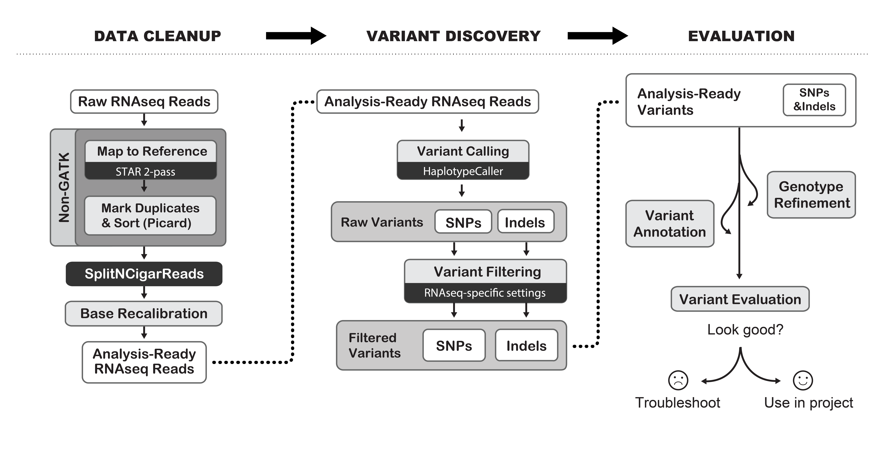

# Table of Contents <!-- omit in toc -->

- [Introduction](#introduction)
- [Motivation](#motivation)
- [Pre-Discussion](#pre-discussion)
- [Discussion](#discussion)

# Introduction

This RFC lays out the Data Versioning process for St. Jude Cloud.

# Motivation

To provide the community with harmonized data from experiments performed at St. Jude Children's Research Hospital, the St. Jude Cloud team has developed a datatype-specific harmonization workflows. Over time, it is necessary to incorporate bug fixes and other changes in those workflows and the underlying tools. In order to make these changes with minimal impact, we seek to define "data versions", within which, we have evidence that the workflow results are compatible and not "substantially" different. This RFC will lay out the methods by which we determine what constitutes a significant difference in the resulting data.

# Pre-Discussion

We have previously had short discussions regarding changes to our data versioning scheme. Currently we attach the pipeline version used to generate the data to the file's metadata. This has left us in a position where we are hesitant to increment pipelines to new versions or update to new versions of underlying tools. We generally agree that there are many pipeline-level changes that do not materially impact the output results. The goal of this RFC is to determine what changes we can be made without creating a new data version. To do so, we also need to generate metrics and data that we can use to justify to users that the results are not different.

There are a number of approaches that could be taken to do this. We could look at alignment information, in which case, we may want to use results from the QC pipeline to justify. Another option is to examine the results from an analysis perspective. If the variant calls are the same (or reasonably the same), that may be sufficient. These are just two limited examples of options we could use.

Currently we have the RNA-Seq workflow v2.0.0 in use for St. Jude Cloud. We have subsequently released improvements, including the integration of XenoCP. This is not in use for production work as we include the pipeline version with the data files in St. Jude Cloud. Creation of a data versioning standard will enable us to roll out bug fixes and new features on an appropriate timeline and provide confidence to ourselves and our users that data is consistent, hopefully, without requiring complete reruns of all data for any change.

We also have issues with the `msgen` pipeline that is used for WGS and WES. Microsoft has made changes to the pipeline and process throughout the time that we have been using it for production data releases. We have not incremented any versions in that time. So as it stands, we are trusting, without any verification, that any changes introduced are acceptable. 

A data versioning process should help us find a reasonable balance that doesn't stop us from making any changes, ever, but also we want to avoid incorporating any and all changes without any assurances, or insight in `msgen`'s case, that those changes are reasonable and not meaningfully impactful to the data results.

# Discussion

## Whole-Genome and Whole-Exome Sequencing

We propose to evaluate whole-genome (WGS) and whole-exome (WES) sequencing by running well characterized samples through each iteration of the analysis pipeline. The resulting variant calls (gVCFs) will be compared to existing high-quality variant calls. This comparison will be conducted using Illumina's `hap.py` [comparison tool](https://github.com/Illumina/hap.py) as [recommended](https://www.biorxiv.org/content/10.1101/270157v3) by the Global Alliance for Genomics and Health (GA4GH) Benchmarking Team. Specifically, we propose to run samples from the National Institute for Standards and Technology (NIST)'s Genome in a Bottle (GIAB) project. We will  perform analysis using samples HG002, HG003, HG004, HG006, and HG007 for WGS. For WES, we will use samples HG002, HG003, HG004, and HG005. The results from prior iterations of the pipeline will be supplied as the truth set. The variant calls from the new workflow version will be treated as the query. The confident call sets from GIAB will be provided as the truth dataset for a second comparison. In this way we can track divergences in the pipeline and also determine the significance of any discovered divergence.

## RNA-Seq

We propose to evaluate RNA sequencing (RNA-Seq) by running well characterized samples through each iteration of the analysis pipeline. Specifically, we propose to run samples from the National Institute for Standards and Technology (NIST)'s Genome in a Bottle (GIAB) project. We will use RNA-Seq data from HG002, HG004, and HG005 samples. These three samples will be run through new iterations of the [St. Jude Cloud RNA-Seq harmonization workflow](https://stjudecloud.github.io/rfcs/0001-rnaseq-workflow-v2.0.0.html). The pipeline will output aligned BAMs and feature count files for each sample. We will then generate variant calls using the [GATK RNA-Seq short variant discovery best practices workflow](https://gatk.broadinstitute.org/hc/en-us/articles/360035531192-RNAseq-short-variant-discovery-SNPs-Indels-). We will use Illumina's hap.py comparison tool, along with the high confidence variant calls from GIAB, to compare output from prior versions of the RNA-Seq pipeline to the proposed version.

### GATK RNA-Seq short variant discovery best practices workflow

The GATK best practices workflows are de facto standards for data processing in bioinformatics. Therefore we will reuse their existing workflow for generating variant calls from RNA-Seq data. The workflow accepts a STAR-aligned BAM file, such as those produced by our RNA-Seq alignment harmonization workflow, and produces a set of variant calls by running a number of GATK steps.



#### Workflow

1. Run Picard `MarkDuplicates`

    ```bash
        picard -Xmx~{java_heap_size}g MarkDuplicates \
            -I ~{bam} \
            -O ~{if create_bam then prefix + ".bam" else "/dev/null"} \
            --VALIDATION_STRINGENCY SILENT \
            --CREATE_INDEX ~{create_bam} \
            --CREATE_MD5_FILE ~{create_bam} \
            --COMPRESSION_LEVEL 5 \
            --METRICS_FILE ~{prefix}.metrics.txt
    ```

2. Run GATK `SplitNCigarReads`

    ```bash
        gatk \
            SplitNCigarReads \
            -R ~{fasta} \
            -I ~{bam} \
            -O ~{prefix}.bam \
            -OBM true
       # GATK is unreasonable and uses the plain ".bai" suffix.
       mv ~{prefix}.bai ~{prefix}.bam.bai
    ```

3. Run GATK Spark-enabled `BaseRecalibrator` (`BaseRecalibratorSpark`).

   ```bash
        gatk \
            --java-options "-Xms4000m" \
            BaseRecalibratorSpark \
            -R ~{fasta} \
            -I ~{bam} \
            ~{if use_original_quality_scores then "--use-original-qualities" else "" } \
            -O ~{prefix}.txt \
            -known-sites ~{dbSNP_vcf} \
            -known-sites ~{sep=" --known-sites " known_indels_sites_VCFs} \
            --spark-master local[4]
   ```

4. Run GATK Spark-enabled `ApplyBQSR` (`ApplyBQSRSpark`).

    ```bash
            gatk \
            --java-options "-Xms3000m" \
            ApplyBQSRSpark \
            --spark-master local[4] \
            -I ~{bam} \
            ~{if use_original_quality_scores then "--use-original-qualities" else "" } \
            -O ~{prefix}.bam \
            --bqsr-recal-file ~{recalibration_report}
    ```

5. Run Picard `IntervalListTools` to generate list of regions to scatter over.

    ```bash
        picard -Xms1g \
            IntervalListTools \
            SCATTER_COUNT=~{scatter_count} \
            SUBDIVISION_MODE=BALANCING_WITHOUT_INTERVAL_SUBDIVISION_WITH_OVERFLOW \
            UNIQUE=~{unique} \
            SORT=~{sort} \
            INPUT=~{interval_list} \
            OUTPUT=out
    ```

6. Run GATK Spark-enabled `HaplotypeCaller` (`HaplotypeCallerSpark`) on each region.

    ```bash
        gatk \
           --java-options "-Xms6000m" \
            HaplotypeCallerSpark \
            -R ~{fasta} \
            -I ~{bam} \
            -L ~{interval_list} \
            -O ~{prefix}.vcf.gz \
            ~{if use_soft_clipped_bases then "" else "--dont-use-soft-clipped-bases"} \
            --standard-min-confidence-threshold-for-calling ~{stand_call_conf} \
           --spark-master local[4]
    ```

7. Run Picard `MergeVcfs`.

    ```bash
        picard -Xms2000m \
            MergeVcfs \
            ~{sep(' ', prefix('--INPUT=', vcfs))} \
            --OUTPUT ~{output_vcf_name}
    ```

8. Run GATK `VariantFiltration`.

    ```bash
        gatk \
            VariantFiltration \
                --R ~{fasta} \
                --V ~{vcf} \
                --window ~{window} \
                --cluster ~{cluster} \
                 ~{sep(' ', prefix('--filter-name ', filter_name))} \
                 ~{sep(' ', prefix('--filter-expression ', squote(filter_expression)))} \
                -O ~{prefix}.vcf.gz
    ```

### Validation and Evaluation

After generation of RNA-Seq variants, we will run Illumina's `hap.py` comparison tool, as recommended by GA4GH, to evaluate the variant calls produced by the newest version of the pipeline compared with those produced by the prior version of the pipeline and compared against the high-quality variant call benchmark set published by GIAB.

We will run multiple comparisons. The first is to compare the prior version of the pipeline and the proposed version of the pipeline, using the confident call set from GIAB as an additional filter. We will use the Gencode CDS regions to restrict analysis to only those expected to be covered by RNA-Seq.

```bash
    hap.py \
        ~{latest release VCF} \
        ~{new version VCF} \
        -o ~{report_name} \
        -r ~{reference_fa} \
        -T ~{gencode_CDS_bed} \
        -f ~{sample_confident_call_bed}
```

We will also run without the GIAB high-confidence callset. 

```bash
    hap.py \
        ~{latest release VCF} \
        ~{new version VCF} \
        -o ~{report_name} \
        -r ~{reference_fa} \
        -T ~{gencode_CDS_bed} \
```

Using a confident call set to restrict the comparison causes variants outside that region (in either the TRUTH or QUERY sample) to be excluded and marked as unknown (`UNK`). As can be seen below, when comparing the first release of our RNA-Seq workflow (v2.0.0) with the latest stable release (v3.0.1), there are a significant number of additional variants found in the new version. This suggests that our decision to increment the major revision was correct. Ultimately, most of those new variants are filtered out with standard quality filters applied during the variant calling pipeline. When looking at the result with the GIAB confident call set applied, there are a large number of variants (1939 SNPs that passed filtering for HG004 below) included. Upon further investigation, there are only 16 SNPs passing filtering that are not called in v2.0.0. The remaining variants are called in both versions, but labeled as `UNK` due to being outside the confident call regions (that is, not found in WGS). 

#### HG002 v2.0.0 vs. v3.0.1 with GIAB confidence set
| Type  | Filter | TRUTH.TOTAL | TRUTH.TP | TRUTH.FN | QUERY.TOTAL | QUERY.FP | QUERY.UNK | FP.gt | FP.al | METRIC.Recall | METRIC.Precision | METRIC.Frac_NA | METRIC.F1_Score | TRUTH.TOTAL.TiTv_ratio | QUERY.TOTAL.TiTv_ratio | TRUTH.TOTAL.het_hom_ratio | QUERY.TOTAL.het_hom_ratio |
| ----- | ------ | ----------- | -------- | -------- | ----------- | -------- | --------- | ----- | ----- | ------------- | ---------------- | -------------- | --------------- | ---------------------- | ---------------------- | ------------------------- | ------------------------- |
| INDEL | ALL    | 606         | 604      | 2        | 1,026       | 235      | 186       | 1     | 15    | 0.997…        | 0.720…           | 0.181…         | 0.836…          |                        |                        | 3.102…                    | 4.115…                    |
| INDEL | PASS   | 606         | 601      | 5        | 769         | 7        | 160       | 1     | 0     | 0.992…        | 0.989…           | 0.208…         | 0.990…          |                        |                        | 3.102…                    | 2.948…                    |
| SNP   | ALL    | 15,278      | 15,270   | 8        | 21,339      | 3,092    | 2,977     | 4     | 107   | 0.999…        | 0.832…           | 0.140…         | 0.908…          | 3.200…                 | 2.806…                 | 1.295…                    | 1.474…                    |
| SNP   | PASS   | 15,278      | 15,266   | 12       | 16,929      | 18       | 1,645     | 4     | 1     | 0.999…        | 0.999…           | 0.097…         | 0.999…          | 3.200…                 | 3.090…                 | 1.295…                    | 1.282…                    |

#### HG002 v2.0.0 vs. v3.0.1 without GIAB confidence set
| Type  | Filter | TRUTH.TOTAL | TRUTH.TP | TRUTH.FN | QUERY.TOTAL | QUERY.FP | QUERY.UNK | FP.gt | FP.al | METRIC.Recall | METRIC.Precision | METRIC.Frac_NA | METRIC.F1_Score | TRUTH.TOTAL.TiTv_ratio | QUERY.TOTAL.TiTv_ratio | TRUTH.TOTAL.het_hom_ratio | QUERY.TOTAL.het_hom_ratio |
| ----- | ------ | ----------- | -------- | -------- | ----------- | -------- | --------- | ----- | ----- | ------------- | ---------------- | -------------- | --------------- | ---------------------- | ---------------------- | ------------------------- | ------------------------- |
| INDEL | ALL    | 760         | 756      | 4        | 1,026       | 268      | 0         | 1     | 25    | 0.995…        | 0.739…           | 0              | 0.848…          |                        |                        | 2.892…                    | 4.115…                    |
| INDEL | PASS   | 760         | 752      | 8        | 769         | 15       | 0         | 1     | 6     | 0.989…        | 0.980…           | 0              | 0.985…          |                        |                        | 2.892…                    | 2.948…                    |
| SNP   | ALL    | 16,924      | 16,912   | 12       | 21,339      | 4,427    | 0         | 5     | 183   | 0.999…        | 0.793…           | 0              | 0.884…          | 3.088…                 | 2.806…                 | 1.282…                    | 1.474…                    |
| SNP   | PASS   | 16,924      | 16,901   | 23       | 16,929      | 28       | 0         | 5     | 2     | 0.999…        | 0.998…           | 0              | 0.998…          | 3.088…                 | 3.090…                 | 1.282…                    | 1.282…                    |

#### HG004 v2.0.0 vs. v3.0.1 with GIAB confidence set
| Type  | Filter | TRUTH.TOTAL | TRUTH.TP | TRUTH.FN | QUERY.TOTAL | QUERY.FP | QUERY.UNK | FP.gt | FP.al | METRIC.Recall | METRIC.Precision | METRIC.Frac_NA | METRIC.F1_Score | TRUTH.TOTAL.TiTv_ratio | QUERY.TOTAL.TiTv_ratio | TRUTH.TOTAL.het_hom_ratio | QUERY.TOTAL.het_hom_ratio |
| ----- | ------ | ----------- | -------- | -------- | ----------- | -------- | --------- | ----- | ----- | ------------- | ---------------- | -------------- | --------------- | ---------------------- | ---------------------- | ------------------------- | ------------------------- |
| INDEL | ALL    | 656         | 652      | 4        | 1,157       | 298      | 199       | 1     | 16    | 0.994…        | 0.689…           | 0.172…         | 0.814…          |                        |                        | 3.257…                    | 4.662…                    |
| INDEL | PASS   | 656         | 649      | 7        | 822         | 6        | 159       | 1     | 1     | 0.989…        | 0.991…           | 0.193…         | 0.990…          |                        |                        | 3.257…                    | 3.100…                    |
| SNP   | ALL    | 15,872      | 15,864   | 8        | 22,068      | 2,791    | 3,413     | 3     | 128   | 0.999…        | 0.850…           | 0.155…         | 0.919…          | 3.160…                 | 2.769…                 | 1.314…                    | 1.467…                    |
| SNP   | PASS   | 15,872      | 15,855   | 17       | 17,817      | 23       | 1,939     | 3     | 2     | 0.999…        | 0.999…           | 0.109…         | 0.999…          | 3.160…                 | 3.027…                 | 1.314…                    | 1.295…                    |

#### HG004 v2.0.0 vs. v3.0.1 without GIAB confidence set
| Type  | Filter | TRUTH.TOTAL | TRUTH.TP | TRUTH.FN | QUERY.TOTAL | QUERY.FP | QUERY.UNK | FP.gt | FP.al | METRIC.Recall | METRIC.Precision | METRIC.Frac_NA | METRIC.F1_Score | TRUTH.TOTAL.TiTv_ratio | QUERY.TOTAL.TiTv_ratio | TRUTH.TOTAL.het_hom_ratio | QUERY.TOTAL.het_hom_ratio |
| ----- | ------ | ----------- | -------- | -------- | ----------- | -------- | --------- | ----- | ----- | ------------- | ---------------- | -------------- | --------------- | ---------------------- | ---------------------- | ------------------------- | ------------------------- |
| INDEL | ALL    | 811         | 803      | 8        | 1,157       | 346      | 0         | 3     | 28    | 0.990…        | 0.701…           | 0              | 0.821…          |                        |                        | 2.955…                    | 4.662…                    |
| INDEL | PASS   | 811         | 800      | 11       | 822         | 14       | 0         | 3     | 5     | 0.986…        | 0.983…           | 0              | 0.985…          |                        |                        | 2.955…                    | 3.100…                    |
| SNP   | ALL    | 17,810      | 17,796   | 14       | 22,068      | 4,272    | 0         | 6     | 226   | 0.999…        | 0.806…           | 0              | 0.893…          | 3.033…                 | 2.769…                 | 1.294…                    | 1.467…                    |
| SNP   | PASS   | 17,810      | 17,782   | 28       | 17,817      | 35       | 0         | 6     | 3     | 0.998…        | 0.998…           | 0              | 0.998…          | 3.033…                 | 3.027…                 | 1.294…                    | 1.295…                    |

#### HG005 v2.0.0 vs. v3.0.1 with GIAB confidence set
| Type  | Filter | TRUTH.TOTAL | TRUTH.TP | TRUTH.FN | QUERY.TOTAL | QUERY.FP | QUERY.UNK | FP.gt | FP.al | METRIC.Recall | METRIC.Precision | METRIC.Frac_NA | METRIC.F1_Score | TRUTH.TOTAL.TiTv_ratio | QUERY.TOTAL.TiTv_ratio | TRUTH.TOTAL.het_hom_ratio | QUERY.TOTAL.het_hom_ratio |
| ----- | ------ | ----------- | -------- | -------- | ----------- | -------- | --------- | ----- | ----- | ------------- | ---------------- | -------------- | --------------- | ---------------------- | ---------------------- | ------------------------- | ------------------------- |
| INDEL | ALL    | 595         | 591      | 4        | 1,049       | 229      | 226       | 1     | 16    | 0.993…        | 0.722…           | 0.215…         | 0.836…          |                        |                        | 2.868…                    | 4.005…                    |
| INDEL | PASS   | 595         | 585      | 10       | 776         | 7        | 181       | 1     | 3     | 0.983…        | 0.988…           | 0.233…         | 0.986…          |                        |                        | 2.868…                    | 2.752…                    |
| SNP   | ALL    | 15,301      | 15,295   | 6        | 22,779      | 2,962    | 4,522     | 4     | 129   | 1.000…        | 0.838…           | 0.199…         | 0.912…          | 3.139…                 | 2.662…                 | 1.176…                    | 1.423…                    |
| SNP   | PASS   | 15,301      | 15,283   | 18       | 17,391      | 18       | 2,090     | 4     | 3     | 0.999…        | 0.999…           | 0.120…         | 0.999…          | 3.139…                 | 3.025…                 | 1.176…                    | 1.178…                    |

#### HG005 v2.0.0 vs. v3.0.1 without GIAB confidence set
| Type  | Filter | TRUTH.TOTAL | TRUTH.TP | TRUTH.FN | QUERY.TOTAL | QUERY.FP | QUERY.UNK | FP.gt | FP.al | METRIC.Recall | METRIC.Precision | METRIC.Frac_NA | METRIC.F1_Score | TRUTH.TOTAL.TiTv_ratio | QUERY.TOTAL.TiTv_ratio | TRUTH.TOTAL.het_hom_ratio | QUERY.TOTAL.het_hom_ratio |
| ----- | ------ | ----------- | -------- | -------- | ----------- | -------- | --------- | ----- | ----- | ------------- | ---------------- | -------------- | --------------- | ---------------------- | ---------------------- | ------------------------- | ------------------------- |
| INDEL | ALL    | 775         | 769      | 6        | 1,049       | 276      | 0         | 1     | 30    | 0.992…        | 0.737…           | 0              | 0.846…          |                        |                        | 2.755…                    | 4.005…                    |
| INDEL | PASS   | 775         | 762      | 13       | 776         | 10       | 0         | 1     | 6     | 0.983…        | 0.987…           | 0              | 0.985…          |                        |                        | 2.755…                    | 2.752…                    |
| SNP   | ALL    | 17,378      | 17,363   | 15       | 22,779      | 5,416    | 0         | 10    | 263   | 0.999…        | 0.762…           | 0              | 0.865…          | 3.026…                 | 2.662…                 | 1.177…                    | 1.423…                    |
| SNP   | PASS   | 17,378      | 17,341   | 37       | 17,391      | 50       | 0         | 10    | 8     | 0.998…        | 0.997…           | 0              | 0.997…          | 3.026…                 | 3.025…                 | 1.177…                    | 1.178…                    |

#### HG002 v3.0.1 vs `main` with GIAB confidence set
| Type  | Filter | TRUTH.TOTAL | TRUTH.TP | TRUTH.FN | QUERY.TOTAL | QUERY.FP | QUERY.UNK | FP.gt | FP.al | METRIC.Recall | METRIC.Precision | METRIC.Frac_NA | METRIC.F1_Score | TRUTH.TOTAL.TiTv_ratio | QUERY.TOTAL.TiTv_ratio | TRUTH.TOTAL.het_hom_ratio | QUERY.TOTAL.het_hom_ratio |
| ----- | ------ | ----------- | -------- | -------- | ----------- | -------- | --------- | ----- | ----- | ------------- | ---------------- | -------------- | --------------- | ---------------------- | ---------------------- | ------------------------- | ------------------------- |
| INDEL | ALL    | 608         | 601      | 7        | 1,018       | 232      | 185       | 1     | 15    | 0.988…        | 0.721…           | 0.182…         | 0.834…          |                        |                        | 3.088…                    | 4.126…                    |
| INDEL | PASS   | 608         | 597      | 11       | 756         | 3        | 156       | 1     | 1     | 0.982…        | 0.995…           | 0.206…         | 0.988…          |                        |                        | 3.088…                    | 2.942…                    |
| SNP   | ALL    | 15,284      | 15,272   | 12       | 21,328      | 3,086    | 2,970     | 3     | 99    | 0.999…        | 0.832…           | 0.139…         | 0.908…          | 3.202…                 | 2.806…                 | 1.297…                    | 1.471…                    |
| SNP   | PASS   | 15,284      | 15,260   | 24       | 16,926      | 21       | 1,645     | 3     | 0     | 0.998…        | 0.999…           | 0.097…         | 0.999…          | 3.202…                 | 3.091…                 | 1.297…                    | 1.282…                    |

#### HG002 v3.0.1 vs `main` without GIAB confidence set
| Type  | Filter | TRUTH.TOTAL | TRUTH.TP | TRUTH.FN | QUERY.TOTAL | QUERY.FP | QUERY.UNK | FP.gt | FP.al | METRIC.Recall | METRIC.Precision | METRIC.Frac_NA | METRIC.F1_Score | TRUTH.TOTAL.TiTv_ratio | QUERY.TOTAL.TiTv_ratio | TRUTH.TOTAL.het_hom_ratio | QUERY.TOTAL.het_hom_ratio |
| ----- | ------ | ----------- | -------- | -------- | ----------- | -------- | --------- | ----- | ----- | ------------- | ---------------- | -------------- | --------------- | ---------------------- | ---------------------- | ------------------------- | ------------------------- |
| INDEL | ALL    | 764         | 752      | 12       | 1,018       | 265      | 0         | 2     | 23    | 0.984…        | 0.740…           | 0              | 0.845…          |                        |                        | 2.907…                    | 4.126…                    |
| INDEL | PASS   | 764         | 747      | 17       | 756         | 8        | 0         | 2     | 5     | 0.978…        | 0.989…           | 0              | 0.984…          |                        |                        | 2.907…                    | 2.942…                    |
| SNP   | ALL    | 16,929      | 16,906   | 23       | 21,328      | 4,422    | 0         | 4     | 184   | 0.999…        | 0.793…           | 0              | 0.884…          | 3.090…                 | 2.806…                 | 1.282…                    | 1.471…                    |
| SNP   | PASS   | 16,929      | 16,887   | 42       | 16,926      | 39       | 0         | 4     | 7     | 0.998…        | 0.998…           | 0              | 0.998…          | 3.090…                 | 3.091…                 | 1.282…                    | 1.282…                    |

#### HG004 v3.0.1 vs `main` with GIAB confidence set
| Type  | Filter | TRUTH.TOTAL | TRUTH.TP | TRUTH.FN | QUERY.TOTAL | QUERY.FP | QUERY.UNK | FP.gt | FP.al | METRIC.Recall | METRIC.Precision | METRIC.Frac_NA | METRIC.F1_Score | TRUTH.TOTAL.TiTv_ratio | QUERY.TOTAL.TiTv_ratio | TRUTH.TOTAL.het_hom_ratio | QUERY.TOTAL.het_hom_ratio |
| ----- | ------ | ----------- | -------- | -------- | ----------- | -------- | --------- | ----- | ----- | ------------- | ---------------- | -------------- | --------------- | ---------------------- | ---------------------- | ------------------------- | ------------------------- |
| INDEL | ALL    | 950         | 917      | 33       | 1,147       | 23       | 199       | 2     | 1     | 0.965…        | 0.976…           | 0.173…         | 0.970…          |                        |                        | 5.032…                    | 4.558…                    |
| INDEL | PASS   | 950         | 651      | 299      | 823         | 6        | 158       | 2     | 1     | 0.685…        | 0.991…           | 0.192…         | 0.810…          |                        |                        | 5.032…                    | 3.064…                    |
| SNP   | ALL    | 18,648      | 18,601   | 47       | 22,089      | 71       | 3,417     | 7     | 7     | 0.997…        | 0.996…           | 0.155…         | 0.997…          | 2.962…                 | 2.765…                 | 1.451…                    | 1.469…                    |
| SNP   | PASS   | 18,648      | 15,875   | 2,773    | 17,823      | 8        | 1,940     | 1     | 1     | 0.851…        | 0.999…           | 0.109…         | 0.919…          | 2.962…                 | 3.026…                 | 1.451…                    | 1.295…                    |

#### HG004 v3.0.1 vs `main` without GIAB confidence set
| Type  | Filter | TRUTH.TOTAL | TRUTH.TP | TRUTH.FN | QUERY.TOTAL | QUERY.FP | QUERY.UNK | FP.gt | FP.al | METRIC.Recall | METRIC.Precision | METRIC.Frac_NA | METRIC.F1_Score | TRUTH.TOTAL.TiTv_ratio | QUERY.TOTAL.TiTv_ratio | TRUTH.TOTAL.het_hom_ratio | QUERY.TOTAL.het_hom_ratio |
| ----- | ------ | ----------- | -------- | -------- | ----------- | -------- | --------- | ----- | ----- | ------------- | ---------------- | -------------- | --------------- | ---------------------- | ---------------------- | ------------------------- | ------------------------- |
| INDEL | ALL    | 1,145       | 1,106    | 39       | 1,147       | 33       | 0         | 4     | 7     | 0.966…        | 0.971…           | 0              | 0.969…          |                        |                        | 4.549…                    | 4.558…                    |
| INDEL | PASS   | 1,145       | 803      | 342      | 823         | 12       | 0         | 4     | 5     | 0.701…        | 0.985…           | 0              | 0.819…          |                        |                        | 4.549…                    | 3.064…                    |
| SNP   | ALL    | 22,057      | 21,985   | 72       | 22,089      | 104      | 0         | 14    | 13    | 0.997…        | 0.995…           | 0              | 0.996…          | 2.769…                 | 2.765…                 | 1.465…                    | 1.469…                    |
| SNP   | PASS   | 22,057      | 17,809   | 4,248    | 17,823      | 14       | 0         | 3     | 2     | 0.807…        | 0.999…           | 0              | 0.893…          | 2.769…                 | 3.026…                 | 1.465…                    | 1.295…                    |

#### HG005 v3.0.1 vs `main` with GIAB confidence set
| Type  | Filter | TRUTH.TOTAL | TRUTH.TP | TRUTH.FN | QUERY.TOTAL | QUERY.FP | QUERY.UNK | FP.gt | FP.al | METRIC.Recall | METRIC.Precision | METRIC.Frac_NA | METRIC.F1_Score | TRUTH.TOTAL.TiTv_ratio | QUERY.TOTAL.TiTv_ratio | TRUTH.TOTAL.het_hom_ratio | QUERY.TOTAL.het_hom_ratio |
| ----- | ------ | ----------- | -------- | -------- | ----------- | -------- | --------- | ----- | ----- | ------------- | ---------------- | -------------- | --------------- | ---------------------- | ---------------------- | ------------------------- | ------------------------- |
| INDEL | ALL    | 592         | 585      | 7        | 1,052       | 234      | 230       | 0     | 22    | 0.988…        | 0.715…           | 0.219…         | 0.830…          |                        |                        | 2.799…                    | 4.063…                    |
| INDEL | PASS   | 592         | 580      | 12       | 775         | 7        | 185       | 0     | 5     | 0.980…        | 0.988…           | 0.239…         | 0.984…          |                        |                        | 2.799…                    | 2.779…                    |
| SNP   | ALL    | 15,299      | 15,292   | 7        | 22,769      | 2,969    | 4,508     | 3     | 132   | 1.000…        | 0.837…           | 0.198…         | 0.911…          | 3.139…                 | 2.661…                 | 1.176…                    | 1.419…                    |
| SNP   | PASS   | 15,299      | 15,281   | 18       | 17,382      | 23       | 2,078     | 3     | 2     | 0.999…        | 0.998…           | 0.120…         | 0.999…          | 3.139…                 | 3.024…                 | 1.176…                    | 1.176…                    |

#### HG005 v3.0.1 vs `main` without GIAB confidence set
| Type  | Filter | TRUTH.TOTAL | TRUTH.TP | TRUTH.FN | QUERY.TOTAL | QUERY.FP | QUERY.UNK | FP.gt | FP.al | METRIC.Recall | METRIC.Precision | METRIC.Frac_NA | METRIC.F1_Score | TRUTH.TOTAL.TiTv_ratio | QUERY.TOTAL.TiTv_ratio | TRUTH.TOTAL.het_hom_ratio | QUERY.TOTAL.het_hom_ratio |
| ----- | ------ | ----------- | -------- | -------- | ----------- | -------- | --------- | ----- | ----- | ------------- | ---------------- | -------------- | --------------- | ---------------------- | ---------------------- | ------------------------- | ------------------------- |
| INDEL | ALL    | 769         | 761      | 8        | 1,052       | 287      | 0         | 1     | 37    | 0.990…        | 0.727…           | 0              | 0.838…          |                        |                        | 2.689…                    | 4.063…                    |
| INDEL | PASS   | 769         | 756      | 13       | 775         | 15       | 0         | 1     | 9     | 0.983…        | 0.981…           | 0              | 0.982…          |                        |                        | 2.689…                    | 2.779…                    |
| SNP   | ALL    | 17,387      | 17,362   | 25       | 22,769      | 5,407    | 0         | 9     | 266   | 0.999…        | 0.763…           | 0              | 0.865…          | 3.025…                 | 2.661…                 | 1.178…                    | 1.419…                    |
| SNP   | PASS   | 17,387      | 17,337   | 50       | 17,382      | 45       | 0         | 8     | 4     | 0.997…        | 0.997…           | 0              | 0.997…          | 3.025…                 | 3.024…                 | 1.178…                    | 1.176…                    |
