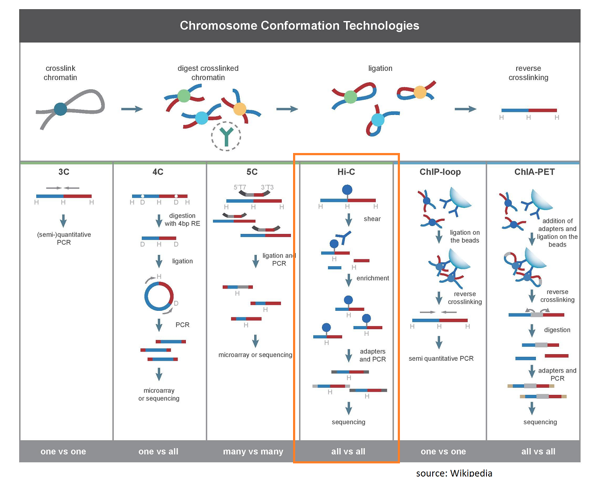
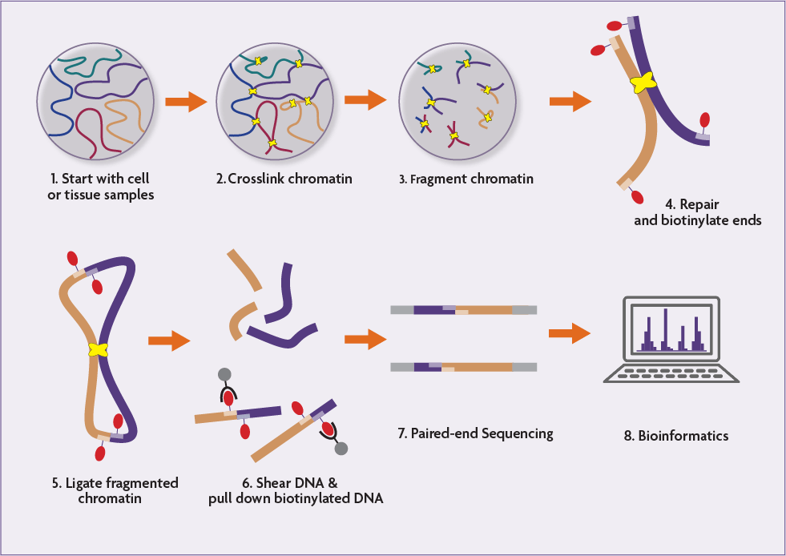

# Hi-C Pipeline <!-- omit in toc -->

- [Introduction](#introduction)
- [Motivation](#motivation)
- [Discussion](#discussion)
- [Specification](#specification)
- [Further Reading](#further-reading)

# Introduction

This RFC lays out the specification for the Hi-C harmonization pipeline. Hi-C is a high-throughput epigenetic technique to investigate chromatin conformation.

As an epigenetic technique, the goals of a typical Hi-C experiment differ from those typical of experiments using genomic or transcriptomic sequencing methods (e.g. Whole-Genome, Whole-Exome, and RNA-Seq) that are more commonly curated by St. Jude Cloud. Epigenetics can be defined as "the study of changes in gene function that are mitotically and/or meiotically heritable and that do not entail a change in DNA sequence" ([Dupont, 2009](https://www.ncbi.nlm.nih.gov/pmc/articles/PMC2791696)). The latter part of this definition (_"that do not entail a change in DNA sequence"_) is vital to understanding how Hi-C (and other epigentic techniques) treat sequenced data. Often, the reads are merely useful for identifying the location of epigenetic events.


# Motivation

To provide the  community access to data from Hi-C experiments performed at St. Jude Children's Research Hospital, we propose the following data harmonization pipeline. The goal of this pipeline is to provide harmonized files for Hi-C data. For this pipeline, we will make no recommendations on downstream analysis, focusing instead on harmonizing the underlying sequencing data and leaving analysis decisions to the user.

# Discussion

Hi-C investigates the three dimensional structure of the chromosomes. Chromosome Conformation Capture (3C) was the first molecular method to enable investigation of physical chromatin interactions. Other subsequent methods include 4C and 5C. Hi-C combines the 3C technique with next-generation sequencing. 

 [source](https://dnatech.genomecenter.ucdavis.edu/hi-c-library-preparations-and-sequencing/)

The Hi-C method measures the frequency at which two fragments physically associate. Chromosomes in physical proximity are crosslinked (typically, with formaldehyde). The chromatin are then fragmented into crosslinked pairs. The ends of the fragments are then repaired and ligated together. The tagged fragments are then selected and sequenced. The hybrid fragments are then used to identify DNA interactions.

 [source](https://www.activemotif.com/catalog/1317/hi-c-service)

Though Hi-C experiments utilize paired-end sequencing, the reads can not be mapped using the paired-end mode of aligners. Since the two reads in the pair come from different fragments, the insert size of the pair is highly variable and this violates the assumptions that most paired-end aligners make. Therefore reads are often mapped as independent single-end reads. The goal of finding the ligation junctions in the Hi-C experiment have led to most projects using an iterative mapping strategy. Often starting with a truncated read and searching for a unique mapping. Non-uniquely mapped reads are then extended and an additional alignment run is performed. This can be done iteratively until the reads are either uniquely mapped or no unique mapping is found for each read. Only reads with both ends uniquely mapped are retained for analysis.

At Jinghui's direction, this workflow will provide Hi-C data in a raw format. We will opt to provide this in unaligned BAM format.
# Specification

## Dependencies

- Picard Tools

## Reference Files

There are no reference files for the Hi-C harmonization workflow.


## Workflow

Here are the resulting steps in the Hi-C workflow. There might be slight alterations in the actual implementation, which can be found in [the St. Jude Cloud workflows repository](https://github.com/stjudecloud/workflows/blob/master/workflows/hic/hic-standard.wdl).

1. Run `picard ValidateSam` on the incoming BAM to ensure that it is well-formed enough to strip alignment information.

    ```bash
    picard ValidateSamFile \
                        I=$INPUT_BAM \                     # Input BAM.
                        IGNORE=INVALID_PLATFORM_VALUE \    # Validations to ignore.
                        IGNORE=MISSING_PLATFORM_VALUE
    ```

2. Run Picard `RevertSam` on the validated BAM file.

    ```bash
        picard RevertSam \
                INPUT=$INPUT_BAM \                        # Input BMA to revert
                OUTPUT=$REVERTED_BAM \                    # Output unaligned BAM name
                REMOVE_ALIGNMENT_INFORMATION=true \       # Remove alignments
                REMOVE_DUPLICATE_INFORMATION=true \       # Remove duplicate flags
                VALIDATION_STRINGENCY=SILENT \            # Ignore some validation warnings
                SORT_ORDER=queryname                      # Sort by queryname
    ```


# Further Reading
- [The Hitchhiker's Guide to Hi-C Analysis: Practical guidelines](https://www.ncbi.nlm.nih.gov/pmc/articles/PMC4347522/)
- [Hi-C (genomic analysis technique) [Wikipedia]](https://en.wikipedia.org/wiki/Hi-C_(genomic_analysis_technique))