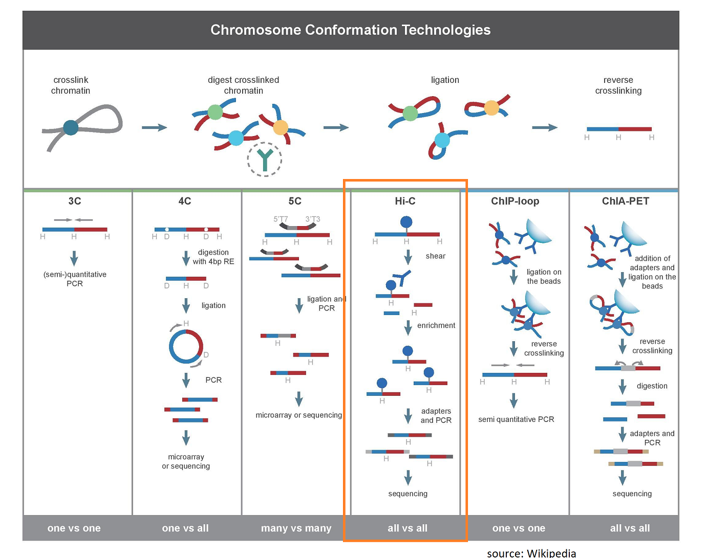
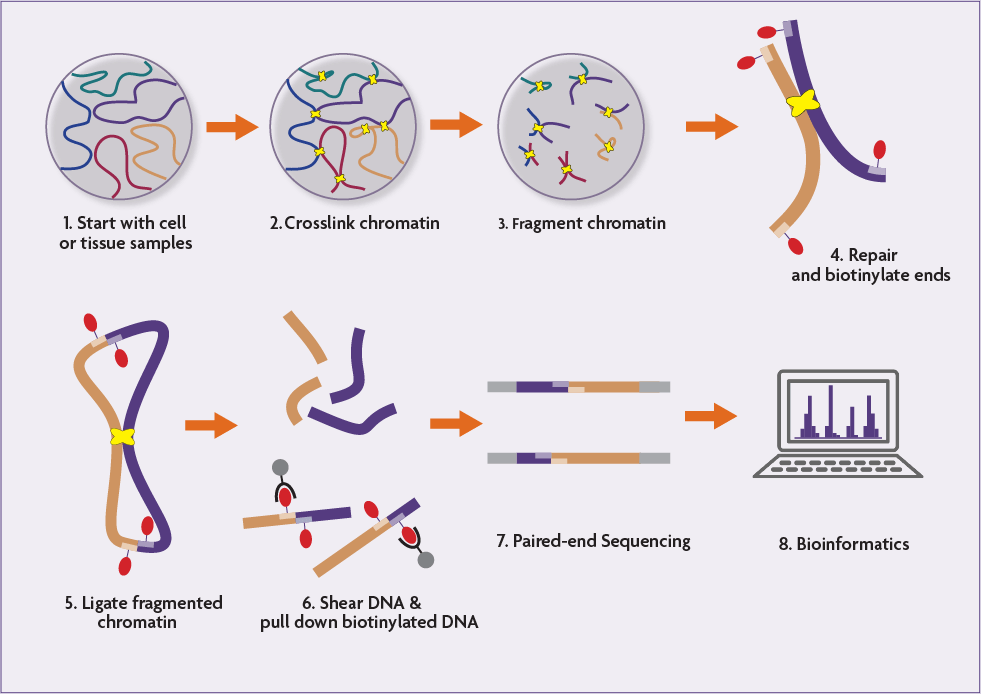

# Hi-C Pipeline <!-- omit in toc -->

- [Introduction](#introduction)
- [Motivation](#motivation)
- [Discussion](#discussion)
- [Specification](#specification)
- [Further Reading](#further-reading)

# Introduction

This RFC lays out the specification for the Hi-C harmonization pipeline. Hi-C is a high-throughput epigenetic technique to investigate chromatin conformation.

As an epigenetic technique, the goals of a typical Hi-C experiment differ from those typical of experiments using genomic or transcriptomic sequencing methods (e.g. Whole-Genome, Whole-Exome, and RNA-Seq) that are more commonly curated by St. Jude Cloud. Epigenetics can be defined as "the study of changes in gene function that are mitotically and/or meiotically heritable and that do not entail a change in DNA sequence" ([Dupont, 2009](https://www.ncbi.nlm.nih.gov/pmc/articles/PMC2791696)). The latter part of this definition (_"that do not entail a change in DNA sequence"_) is vital to understanding how Hi-C (and other epigentic techniques) treat sequenced data. Often, the reads are merely useful for identifying the location of epigenetic events.


# Motivation

To provide the  community access to data from Hi-C experiments performed at St. Jude Children's Research Hospital, we propose the following data harmonization pipeline. The goal of this pipeline is to provide harmonized files for Hi-C data. For this pipeline, we will make no recommendations on downstream analysis, focusing instead on harmonizing the underlying sequencing data and leaving analysis decisions to the user.

# Discussion

Hi-C investigates the three dimensional structure of the chromosomes. Chromosome Conformation Capture (3C) was the first molecular method to enable investigation of physical chromatin interactions. Other subsequent methods include 4C and 5C. Hi-C combines the 3C technique with next-generation sequencing. 

 [source](https://dnatech.genomecenter.ucdavis.edu/hi-c-library-preparations-and-sequencing/)

The Hi-C method measures the frequency at which two fragments physically associate. Chromosomes in physical proximity are crosslinked (typically, with formaldehyde). The chromatin are then fragmented into crosslinked pairs. The ends of the fragments are then repaired and ligated together. The tagged fragments are then selected and sequenced. The hybrid fragments are then used to identify DNA interactions.

 [source](https://www.activemotif.com/catalog/1317/hi-c-service)

Though Hi-C experiments utilize paired-end sequencing, the reads can not be mapped using the paired-end mode of aligners. Since the two reads in the pair come from different fragments, the insert size of the pair is highly variable and this violates the assumptions that most paired-end aligners make. Therefore reads are often mapped as independent single-end reads. The goal of finding the ligation junctions in the Hi-C experiment have led to most projects using an iterative mapping strategy. Often starting with a truncated read and searching for a unique mapping. Non-uniquely mapped reads are then extended and an additional alignment run is performed. This can be done iteratively until the reads are either uniquely mapped or no unique mapping is found for each read. Only reads with both ends uniquely mapped are retained for analysis.

# Specification

## Dependencies

- [Picard Tools](https://broadinstitute.github.io/picard/)
- [samtools](https://www.htslib.org/)
- [bowtie2](https://bowtie-bio.sourceforge.net/bowtie2/index.shtml)
- [HiC-Pro](https://github.com/nservant/HiC-Pro)
- [juicer](https://github.com/aidenlab/juicer)
- [bedtools](https://github.com/arq5x/bedtools2)

## Reference Files

The following reference files are used as the basis of the Hi-C Workflow:

- Similarly to all analysis pipelines in St. Jude Cloud, we use the `GRCh38_no_alt` analysis set for our reference genome. You can get a copy of the file [here](https://ftp.ncbi.nlm.nih.gov/genomes/all/GCA/000/001/405/GCA_000001405.15_GRCh38/seqs_for_alignment_pipelines.ucsc_ids/GCA_000001405.15_GRCh38_no_alt_analysis_set.fna.gz). Additionally, you can get the file by running the following commands:

  ```bash
  wget ftp://ftp.ncbi.nlm.nih.gov/genomes/all/GCA/000/001/405/GCA_000001405.15_GRCh38/seqs_for_alignment_pipelines.ucsc_ids/GCA_000001405.15_GRCh38_no_alt_analysis_set.fna.gz -O GRCh38_no_alt.fa.gz
  gunzip GRCh38_no_alt.fa.gz

  echo "a6da8681616c05eb542f1d91606a7b2f  GRCh38_no_alt.fa" > GRCh38_no_alt.fa.md5
  md5sum -c GRCh38_no_alt.fa.md5
  # > GRCh38_no_alt.fa: OK
  ```

- The following command is used to prepare the bowtie2 index files:

    ```bash
    bowtie2-build --threads=~{ncpu} ~{base} ~{prefix}
    ```

- The Hi-C pipeline also uses a standard list of excluded regions. This can be
obtained using the following commands:

```bash
wget https://github.com/Boyle-Lab/Blacklist/raw/master/lists/hg38-blacklist.v2.bed.gz
```

- The chromosome lengths are extracted from the reference using the following commands:

```bash
samtools faidx -o GRCh38_no_alt.fa.fai GRCh38_no_alt.fa
cut -f 1,2 GRCh38_no_alt.fa.fai > chromsizes.tab
```

- A fragment file for each desired restriction site can also be extracted using HiC-Pro:

```bash
digest_genome.py \
            -r ~{restriction_site} \
            -o ~{output_name} \
            ~{reference}
```

## Workflow

Here are the resulting steps in the Hi-C workflow. There might be slight alterations in the actual implementation, which can be found in [the St. Jude Cloud workflows repository](https://github.com/stjudecloud/workflows/blob/master/workflows/hic/hic-standard.wdl). The workflow primarily consists of a WDL reimplementation of [HiC-Pro](https://github.com/nservant/HiC-Pro/tree/master).

1. Run `picard ValidateSam` on the incoming BAM to ensure that it is well-formed enough to strip alignment information.

    ```bash
    picard ValidateSamFile \
                        I=$INPUT_BAM \                     # Input BAM.
                        IGNORE=INVALID_PLATFORM_VALUE \    # Validations to ignore.
                        IGNORE=MISSING_PLATFORM_VALUE
    ```

2. Run samtools `quickcheck` on the BAM file.

    ```bash
        samtools quickcheck \
            $INPUT_BAM
    ```

3. Run samtools `split` on the BAM file.

    ```bash
        samtools split \
            --threads "$n_cores" \
            -u ~{prefix}.unaccounted_reads.bam \
            -f '~{prefix}.%!.bam' \
            ~{bam}

    ```
4. Run samtools `collate` and `fastq` on split BAM files to create FASTQ files.

    ```bash
        samtools collate \
            ~{bam} |
        samtools fastq \
            -1 $READ_ONE_GZ \   # Fastq with read 1s
            -2 $READ_TWO_GZ \   # Fastq with read 2s
    ```

5. Run fq `lint` to validate FASTQ files.

    ```bash
        fq lint \
            ~{read_one_fastq} \
            ~{read_two_fastq}
    ```

6. Extract read groups from the input BAM file.

    ```bash
        BAM="~{bam}" OUTFILE="read_groups.json" python - <<END
        import os  # lint-check: ignore
        import pysam  # lint-check: ignore
        import json  # lint-check: ignore
        sam = pysam.AlignmentFile(os.environ["BAM"], "rb")

        out_file = open(os.environ["OUTFILE"], "w")
        header = sam.header.to_dict()["RG"]
        modified_header = []
        for read_group in sorted(header, key=lambda d: d['ID']):
            modified_header.append({k:v.upper() if k=='PL' else v for k,v in read_group.items()})
        json.dump(modified_header, out_file)
        out_file.close()
        END
    ```

7. Split each read group into smaller groups.

    ```bash
        let "lines = ~{reads_per_file} * 4"
        zcat ~{fastq} | split -l $lines -d -a 6 - ~{prefix}

        for file in "~{prefix}"*; do
            mv "$file" "${file}.fastq"
            echo "gzip ${file}.fastq" >> cmds
        done
    ```

8. For each pair of read files, align with `bowtie2`.

    ```bash
    bowtie2 \
        --trim5 0 \
        --trim3 0 \
        -N 0 \
        -L 30 \
        --dpad 15 \
        --gbar 4 \
        --end-to-end \
        --mp 6 \
        --np 1 \
        --rdg 5,3 \
        --rfg 5,3 \
        --minins 0 \
        --maxins 500 \
        --un-gz ~{unpaired_unaligned_reads} \
        --met-file ~{metrics_files} \
        --met 1 \
        --rg-id ~{read_group_id} \
        --rg ~{read_group_fields} \  # --rg is specified once per read group field, other than ID.
        -p 1 \
        --reorder \
        --seed 0 \
        --score-min L,-0.600000,-0.200000 \
        -i S,1.000000,0.500000 \
        -D 20 \
        -R 3 \
        -x ~{BOWTIE2_DB} \
        -U ~{single_end_Fastq} \
    | samtools view -bS - > ~{global_bam}
    ```
9. If a ligation site was provided, filter the global alignment BAM to remove unmapped reads.

    ```bash
    samtools view \
        --threads "$n_cores" \
        -hb \
        -F 0x4 \
        ~{global_alignment_bam} \
        > ~{global_mapped_only_bam}
    ```

10. If a ligation site was provided, run HiC-Pro cutsite trimming.

    ```bash
    cutsite_trimming \
        --fastq $fastq \
        --cutsite ~{ligation_site} \
        --out ~{trimmed_fastq} \
        > ~{trim_log}

        gzip ~{trimmed_fastq} && rm $fastq
    ```

11. If a ligation site was provided, realign unmapped reads after trimming with `bowtie2`.

    ```bash
    bowtie2 \
        --trim5 0 \
        --trim3 0 \
        -N 0 \
        -L 20 \
        --dpad 15 \
        --gbar 4 \
        --end-to-end \
        --mp 6 \
        --np 1 \
        --rdg 5,3 \
        --rfg 5,3 \
        --minins 0 \
        --maxins 500 \
        --met-file ~{metrics_files} \
        --met 1 \
        --rg-id ~{read_group_id} \
        --rg ~{read_group_fields} \  # --rg is specified once per read group field, other than ID.
        -p 1 \
        --reorder \
        --seed 0 \
        --score-min L,-0.600000,-0.200000 \
        -i S,1.000000,0.500000 \
        -D 20 \
        -R 3 \
        -x ~{BOWTIE2_DB} \
        -U ~{unaligned_trimmed_fastq} \
    | samtools view -bS - > ~{local_aligned_bam}
    ```

12. If a ligation site was provided, merge the realigned reads and the globally mapped reads.

    ```bash
    samtools merge \
        --threads "$n_cores" \
        -n \
        -c \
        -p \
        ~{merged_bam} \
        ~{global_bam} ~{local_aligned_bam}
    ```

13. Run samtools `sort` to sort the resulting BAM file.

    ```bash
    samtools sort \
        --threads $n_cores \
        -l 6 \
        -m 2560M \
        -n \
        -o ~{sorted_bam} \
        ~{merged_bam}
    ```

14. Compute mapping statistics for each read. Note: this is a reimplementation of https://github.com/nservant/HiC-Pro/blob/master/scripts/mapping_stat.sh

    ```bash
    echo "## HiC-Pro Mapping Statistics" > ~{mapstat}
    echo "## ~{mapstat}" >> ~{mapstat}

    total_reads=$(samtools view -c ~{sorted_bam})

    mapped_reads=$(samtools view -c -F 4 ~{sorted_bam})

    global_mapped_reads=$(samtools view -c -F 4 ~{global_bam})

    if ~{local_bam}
    then
        local_mapped_reads=$(samtools view -c -F 4 ~{local_bam})
    fi

    echo -e "total_R1\t$total_reads" >> ~{mapstat}
    echo -e "mapped_R1\t$mapped_reads" >> ~{mapstat}
    echo -e "global_R1\t$global_mapped_reads" >> ~{mapstat}
    echo -e "local_R1\t$local_mapped_reads" >> ~{mapstat}
    ```

15. Merge the read ends with HiC-Pro's `mergeSAM.py`.

    ```bash
    python mergeSAM.py \
        -q 10 \
        -t \
        -v \
        -f ~{read_one_sorted_bam} \
        -r ~{read_two_sorted_bam} \
        -o ~{paired_bam}
    ```

16. Extract mapped Hi-C fragments with HiC-Pro's `mapped_2hic_fragments.py`. The fragment file is extracted from the genome FASTA and corresponds to the restriction site enzyme used in the Hi-C experiment.

    ```bash
    python mapped_2hic_fragments.py -f ~{fragment_file} \
        -v \
        -r ~{paired_bam} \
        -S \
        -a

    LANG=en; sort -k2,2V -k3,3n -k5,5V -k6,6n -o ~{sorted_pairs} ~{pairs}
    ```

17. Merge valid Hi-C interactions. Note: this is a reimplementation of https://github.com/nservant/HiC-Pro/blob/master/scripts/merge_valid_interactions.sh.

    ```bash
    LANG=en; sort \
        -k2,2V -k3,3n -k5,5V -k6,6n \
        -m ~{valid_pairs_files} \
        | awk -F "\t" \
        'BEGIN{c1=0;c2=0;s1=0;s2=0}(c1!=$2 || c2!=$5 || s1!=$3 || s2!=$6){print;c1=$2;c2=$5;s1=$3;s2=$6}' \
        > ~{all_valid_pairs}


    allcount=$(cat ~{valid_pairs_files} | wc -l)
    allcount_rmdup=$(cat ~{all_valid_pairs} | wc -l)
    ndbup=$(( $allcount - $allcount_rmdup ))

    ## merge stat file
    echo -e "valid_interaction\t"$allcount > ~{all_valid_pairs}.mergestat
    echo -e "valid_interaction_rmdup\t"$allcount_rmdup >> ~{all_valid_pairs}.mergestat
    awk 'BEGIN{cis=0;trans=0;sr=0;lr=0} $2 == $5{cis=cis+1; d=$6>$3?$6-$3:$3-$6; if (d<=20000){sr=sr+1}else{lr=lr+1}} $2!=$5{trans=trans+1}END{print "trans_interaction\t"trans"\ncis_interaction\t"cis"\ncis_shortRange\t"sr"\ncis_longRange\t"lr}' ~{all_valid_pairs} >> ~{all_valid_pairs}.mergestat
    ```

18. Merge stats. Note: this is a reimplementation of https://github.com/nservant/HiC-Pro/blob/master/scripts/merge_stats.sh.

    ```bash
    mkdir read1
    ln -s ~{read_one_mapping_stats} read1/
    python /HiC-Pro_3.0.0/scripts/merge_statfiles.py \
        -d read1 \
        -p "*.R1*.mapstat" \
        -v \
        > ~{read_one}.mmapstat

    # merge read2 mapping stats
    mkdir read2
    ln -s ~{read_two_mapping_stats} read2/
    python /HiC-Pro_3.0.0/scripts/merge_statfiles.py \
        -d read2 \
        -p "*.R2*.mapstat" \
        -v \
        > ~{read_two}.mmapstat

    # merge pairing stats
    mkdir pairs
    ln -s ~{pairing_stats} pairs/
    python /HiC-Pro_3.0.0/scripts/merge_statfiles.py \
        -d pairs \
        -p "*.pairstat" \
        -v \
        > ~{prefix}.mpairstat

    # merge RS stat
    mkdir rsstat
    ln -s ~{rs_stat_files} rsstat/
    python /HiC-Pro_3.0.0/scripts/merge_statfiles.py \
        -d rsstat \
        -p "*.RSstat" \
        -v \
        > ~{prefix}.mRSstat
    ```

19. QC Hi-C results. Note: this is a reimplementation of https://github.com/nservant/HiC-Pro/blob/master/scripts/make_plots.sh.

    ```bash
    mkdir plots

    mkdir bowtie
    ln -sf ~{mapstat_files} bowtie/
    ln -sf ~{pairstat_files} bowtie/

    mkdir hic
    ln -sf ~{rs_stat_files} ~{valid_pair_files} hic/

    mkdir stats
    ln -sf ~{all_valid_pairs}.mergestat stats/

    # mapping plots
    if [[ "all" == "all" || "all" == "mapping" ]]
    then
        R CMD BATCH \
            --no-save \
            --no-restore \
            "--args picDir='plots' bwtDir='bowtie' sampleName='~{prefix}' r1tag='.R1' r2tag='.R2'" \
            /HiC-Pro_3.0.0/scripts/plot_mapping_portion.R \
            plot_mapping_portion.Rout
    fi

    # pairing plots
    if [[ "all" == "all" || "all" == "pairing" ]]
    then
        R CMD BATCH \
            --no-save \
            --no-restore \
            "--args picDir='plots' bwtDir='bowtie' sampleName='~{prefix}' rmMulti='1' rmSingle='1'" \
            /HiC-Pro_3.0.0/scripts/plot_pairing_portion.R \
            plot_pairing_portion.Rout
    fi

    # filtering plots
    if [[ "all" == "all" || "all" == "filtering" ]]
    then
        R CMD BATCH \
            --no-save \
            --no-restore \
            "--args picDir='plots' hicDir='hic' sampleName='~{prefix}' rmMulti='1' rmSingle='1'" \
            /HiC-Pro_3.0.0/scripts/plot_hic_fragment.R \
            plot_hic_fragment.Rout
    fi

    # contacts plots
    if [[ "all" == "all" || "all" == "contacts" ]]
    then
        R CMD BATCH \
            --no-save \
            --no-restore \
            "--args picDir='plots' hicDir='hic' statsDir='stats' sampleName='~{prefix}'" \
            /HiC-Pro_3.0.0/scripts/plot_hic_contacts.R \
            plot_hic_contacts.Rout
    fi
    ```

20. Build raw contact maps.

    ```bash
    for bin_size in ~{sep(" ", bin_sizes)}
    do
        cat ~{hic_file} \
        | /HiC-Pro_3.0.0/scripts/build_matrix \
            --matrix-format ~{matrix_format} \
            ~{(
                if (length(bin_sizes) > 1)
                then "--binsize $bin_size"
                else "--binfile ~{select_first([genome_fragment, ""])}"
            )} \
            --chrsizes ~{chromsizes} \
            --ifile /dev/stdin \
            --oprefix ~{prefix}_${bin_size}

    done
    ```

21. Run ICE normalization.

    ```bash
    for map in ~{sep(" ", contact_counts)}
    do
        name=$(basename $map)
        for bin in ~{sep(" ", bin_sizes)}
        do
            ice \
                --results_filename ${name}_${bin}_iced.matrix \
                --filter_low_counts_perc ~{filter_low_counts_percentage} \
                --filter_high_counts_perc ~{filter_high_counts_percentage} \
                --max_iter ~{max_iterations} \
                --eps ~{precision} \
                --remove-all-zeros-loci \
                --output-bias 1 \
                $map
        done
    done
    ```

22. Convert Hi-C contacts to ".hic" file using HiC-Pro's `hicpro2juicebox.sh`.

    ```bash
    /HiC-Pro_3.0.0/bin/utils/hicpro2juicebox.sh \
        -i ~{all_valid_pairs} \
        -g ~{chromsizes} \
        -j ~{juicer_tools_jar}
    ```

23. If an exclude list was specified, filter results.

    ```bash
    #left bed
    awk -F "\t" -v OFS="\t" '{print $2,$3,$3,$1}' ~{all_valid_pairs} \
    | slopBed -i stdin -b ~{padding} -g ~{chromsizes} \
    | intersectBed -a stdin -b ~{base} -u > left.bed

    #right bed
    awk -F "\t" -v OFS="\t" '{print $5,$6,$6,$1}' ~{all_valid_pairs} \
    | slopBed -i stdin -b ~{padding} -g ~{chromsizes} \
    | intersectBed -a stdin -b ~{base} -u > right.bed

    cat <(cut -f 4 left.bed) <(cut -f 4 right.bed)|sort -u > filter.pair

    python <<CODE
        from collections import defaultdict
        f=open("filter.pair")
        blackID=defaultdict(int)
        while True:
            line=f.readline()
            if not line:
                break
            cols=line.strip().split("\t")
            ID=cols[0]
            blackID[ID]=1

        f2=open("~{all_valid_pairs}")
        outfile1="~{prefix}.allValidPairs.filtered"
        outfile2="~{prefix}.allValidPairs.removed"
        of1=open(outfile1,'w')
        of2=open(outfile2,'w')
        while True:
            line=f2.readline()
            if not line:
                break
            cols=line.strip().split("\t")
            id=cols[0]
            if id in blackID:
                of2.write(line)
            else:
                of1.write(line)
    CODE

    all=`wc -l ~{all_valid_pairs} |cut -d " " -f 1`
    filtered=`wc -l ~{prefix}.allValidPairs.removed | cut -d " " -f 1`
    percentage=`echo "$filtered/$all*100"|bc -l`
    echo -e "$filtered read pairs are filtered out from a total of $all, accounting for ${percentage} %\n" \
        | tee \
        > ~{prefix}.allValidPairs.stats
    ```

24. Write HiLOW-style QC report.

    ```bash
    python <<CODE
        import os
        FILES = ["~{all_valid_pairs_stats}", "~{pairing_stats}", "~{mapping_stats_read1}", "~{mapping_stats_read2}"]
        VARIABLE = ["valid_interaction", "cis_shortRange", "cis_longRange", "Total_pairs_processed", "Reported_pairs", "total_R2", "mapped_R2", "total_R1", "mapped_R1"]
        RESULTS = {}
        for eachfile in FILES:
            with open(eachfile) as f:
                for line in f:
                    array = line.split()
                    if array[0] in VARIABLE:
                        RESULTS[array[0]] = int(array[1])

        PERCENTAGES = {}
        COUNTS = {}
        VERDICT = {}
        REP_VAR = ["R1_aligned", "R2_aligned", "valid_interactionPairs", "cis_shortRange", "cis_longRange"]

        if os.path.isfile('~{fithichip_bed}'):
            with open('~{fithichip_q01_bed}') as fithichip:
                LOOPS_SIGNIFICANT = len(fithichip.readlines())-1
            with open('~{fithichip_bed}') as fithichip:
                LOOPS = len(fithichip.readlines())-1
        if os.path.isfile("~{peaks_bed}"):
            with open("~{peaks_bed}") as peaks:
                PEAKS = len(peaks.readlines())-1

        PERCENTAGES["R1_aligned"] = round((RESULTS["mapped_R1"]*100)/RESULTS["total_R1"])
        PERCENTAGES["R2_aligned"] = round((RESULTS["mapped_R2"]*100)/RESULTS["total_R2"])
        PERCENTAGES["valid_interactionPairs"] = round((RESULTS["valid_interaction"]*100)/RESULTS["Reported_pairs"])
        PERCENTAGES["cis_shortRange"] = round((RESULTS["cis_shortRange"]*100)/RESULTS["valid_interaction"])
        PERCENTAGES["cis_longRange"] = round((RESULTS["cis_longRange"]*100)/RESULTS["valid_interaction"])
        COUNTS["R1_aligned"] = RESULTS["mapped_R1"]
        COUNTS["R2_aligned"] = RESULTS["mapped_R2"]
        COUNTS["valid_interactionPairs"] = RESULTS["valid_interaction"]
        COUNTS["cis_shortRange"] = RESULTS["cis_shortRange"]
        COUNTS["cis_longRange"] = RESULTS["cis_longRange"]

        for aligned in ["R1_aligned", "R2_aligned"]:
            if PERCENTAGES[aligned] > 80:
                VERDICT[aligned] = "GOOD"
            else:
                VERDICT[aligned] = "BAD"

        if PERCENTAGES["valid_interactionPairs"] > 50:
            VERDICT["valid_interactionPairs"] = "GOOD"
        else:
            VERDICT["valid_interactionPairs"] = "BAD"

        if PERCENTAGES["cis_shortRange"] > 50:
            VERDICT["cis_shortRange"] = "BAD"
        elif PERCENTAGES["cis_shortRange"] > 30:
            VERDICT["cis_shortRange"] = "MARGINAL"
        else:
            VERDICT["cis_shortRange"] = "GOOD"

        if PERCENTAGES["cis_longRange"] > 40:
            VERDICT["cis_longRange"] = "GOOD"
        elif PERCENTAGES["cis_longRange"] > 20:
            VERDICT["cis_longRange"] = "MARGINAL"
        else:
            VERDICT["cis_longRange"] = "BAD"

        REPORT = open("~{prefix}_QCreport.txt", 'w')
        REPORT.write("STAT\tCOUNTS\tPERCENTAGE\tVERDICT\n")
        REPORT.write("Total_pairs_processed\t" + str(RESULTS["Total_pairs_processed"]) + "\n")
        for var in REP_VAR:
            REPORT.write(var + "\t" + str(COUNTS[var]) + "\t" + str(PERCENTAGES[var]) + "\t" + VERDICT[var] + '\n')

        if os.path.isfile("~{peaks_bed}"):
            REPORT.write("peaks\t" + str(PEAKS) + "\n")
        if os.path.isfile('~{fithichip_bed}'):
            REPORT.write("loops\t" + str(LOOPS) + "\n")
            REPORT.write("loops_significant\t" + str(LOOPS_SIGNIFICANT) + "\n")
    CODE
    ```

25. Merge per read group BAMs with samtools `merge`.

    ```bash
    samtools merge \
        --threads "$n_cores" \
        -c \
        -p \
        ~{combined_bam} \
        ~{per_read_group_bams}
    ```

26. Run samtools `fixmate` to update mate information.

    ```bash
    samtools fixmate \
        --threads "$n_cores" \
        -c \
        -m \
        ~{combined_bam} \
        ~{fixmate_bam}
    ```

27. Run samtools `sort` to coordinate-sort the BAM.

    ```bash
    samtools sort \
        --threads $n_cores \
        -l 6 \
        -m 3584M \
        -o ~{sorted_bam} \
        ~{fixmate_bam}
    ```

28. Run samtools `markdup`.

    ```bash
    samtools markdup \
        --threads "$n_cores" \
        -f "~{prefix}.txt" \
        --read-coords '[!-9;-?A-~:]+:([!-9;-?A-~]+):([0-9]+):([0-9]+)' \
        --coords-order txy \
        -S \
        --no-multi-dup \
        -l 300 \
        -d 0 \
        -c \
        ~{sorted_bam} \
        ~{prefix}.bam
    ```

29. Index the final BAM with samtools `index`.

    ```bash
    samtools index --threads "$n_cores" ~{prefix}.bam ~{prefix}.bam.bai
    ```

# Further Reading
- [The Hitchhiker's Guide to Hi-C Analysis: Practical guidelines](https://www.ncbi.nlm.nih.gov/pmc/articles/PMC4347522/)
- [Hi-C (genomic analysis technique) [Wikipedia]](https://en.wikipedia.org/wiki/Hi-C_(genomic_analysis_technique))