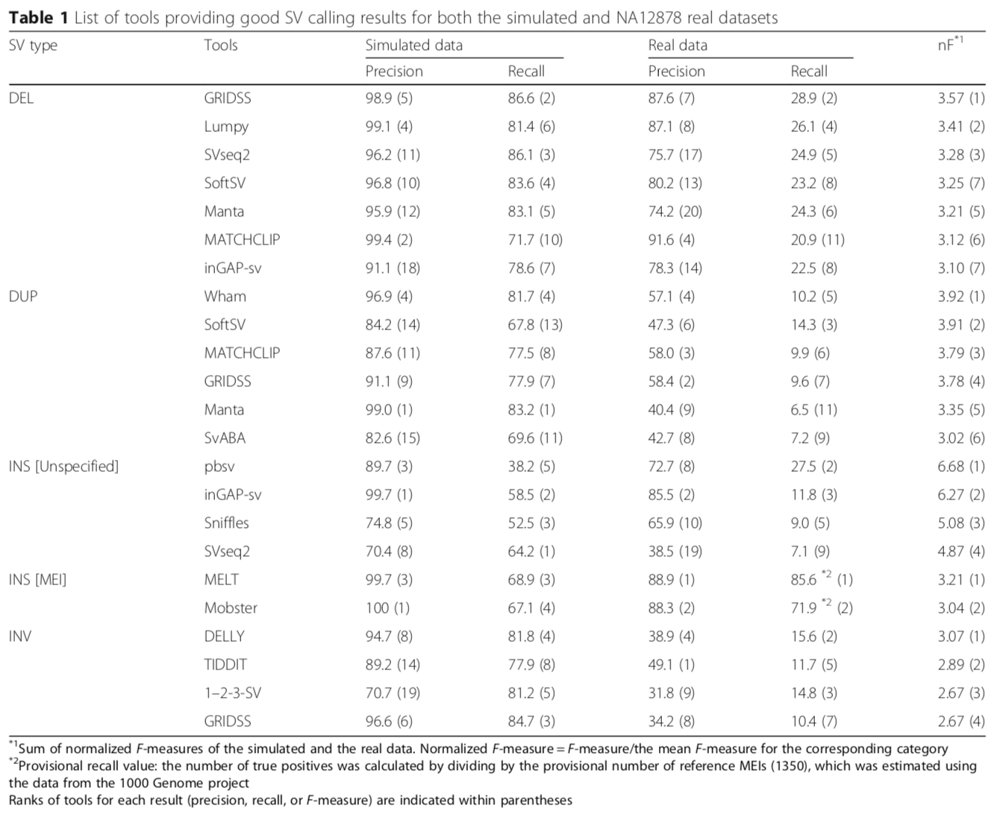

# Table of Contents <!-- omit in toc -->

- [Introduction](#Introduction)
- [Motivation](#motivation)
- [Discussion](#discussion)
- [Specification](#specification)

# Introduction

This RFC lays out the specification for the Structural Variation (SV) pipeline. This is a new pipeline that will produce SV results for St. Jude Cloud samples. 

# Motivation

SJC currently provides short variant [files in gVCF format](https://www.stjude.cloud/docs/guides/data/about-our-data/#gvcf-files) produced through Microsoft Genomics Service using GATK's haplotype caller. Additionally for a subset of datasets, SJC provides [somatic VCF files](https://www.stjude.cloud/docs/guides/data/about-our-data/#somatic-vcf-files) where the SNV/Indel variants were produced by the St. Jude somatic variant analysis pipeline using Bambino. Unlike the gVCF files, these variants have been post-processed and manually curated. The variants were then lifted over to HG38.  

# Discussion

## Current Process

Currently there are three main algorithms applied to detect SV events: CONSERTING [WGS], CREST [WGS], and CICERO [RNA-Seq]. Note that data from all three sources is not available for all samples available on SJC. For those samples where these algorithms were run, the original runs utilize GRCh37-lite and the SJC samples are aligned to GRCh38. CREST and CICERO currently do not support GRCh38. Each of these three algorithms requires significant post processing and manual quality control. Given these factors, utilizing these for SV calling will require significant development, computational time, and evaluation and quality control. Before continuing with these methods alone, it is prudent to review the current state of affairs as it regards the discovery of SVs in genomic samples.

## Comparison to other large-scale genomic projects

The current trend in detection of structural variation in whole genome sequencing is towards the application of multiple algorithms and the synthesis of their resulting callsets to produce a higher quality set of variants. 

### Genome Data Commons (GDC)

The GDC [DNA-Seq variant calling pipeline](https://docs.gdc.cancer.gov/Data/Bioinformatics_Pipelines/DNA_Seq_Variant_Calling_Pipeline/) utilizes MuSE, MuTect2, VarScan2, SomaticSniper, and Pindel for detection of somatic mutations. Pindel is the structural variation algorithm capable of detecting deletions, duplications, insertions, inversions, and translocations using split read information (soft-clips). In addition, VarScan2 detects copy number alterations.  

### gnomad-SV

The [Genome Aggregration Database (gnomAD) - Structural Variation (SV)](https://gnomad.broadinstitute.org/about) encompasses over 10,000 genomes from various disease-specific and population studies. The data is aligned against GRCh37. The dataset utilizes four SV calling algorithms: Manta, DELLY, MELT, and cn.MOPS. Manta detects deletions, duplications, insertions, inversions, and translocations using read pair based information, split reads, and assembly. DELLY detects deletions, duplications, inversions, and translocations using read pair information and split reads. MELT detects a specific class of insertions known as mobile element insertions using read pair information. cn.MOPS detects copy number variation. 

### GoNL

The [Genome of the Netherlands (GoNL)](http://www.nlgenome.nl/) is a project containing 250 trios comprising parents and offspring. The project utilizes a number of SV calling algorithms including: Pindel, MATE-CLEVER, Mobster, 1-2-3SV, BreakDancer, GenomeSTRiP, CNVnator, and DWAC-seq. MATE-CLEVER detects deletions and insertions. Mobster detects mobile element insertions. 1-2-3SV is capable of detecting deletions, insertions, inversions, and translocations. BreakDancer is used for detecting deletions, insertions, inversions, and translocations. GenomeSTRiP is used to detect deletions and is optimized for calling variants in multiple samples. CNVnator detects deletions and duplications. DWAC-seq detects copy number variation using a dynamic window approach. Pindel is described above. 

### 1000 Genomes

The [1000 Genomes Project](https://www.internationalgenome.org/) is a project containing over 2500 individuals across three phases. Similar to other projects, 1000 Genomes used a number of SV calling algorithms including: BreakDancer, Delly, VariationHunter, CNVnator, readDepth, GenomeSTRiP, Pindel, MELT, and DINUMT. Delly is capable of detecting deletions, duplications, inversions, and translocations. VariationHunter is used for detection of deletions, insertions, and inversions. The readDepth algorithm detects deletions and duplications. DINUMT detects nuclear mitochondrial genome insertion events. The other algorithms are described above.  

### GTEx

The [Genotype-Tissue Expression (GTEx)](https://gtexportal.org/home/) contains data from around 1000 individuals. The projects uses Lumpy and GenomeSTRiP for detection of structural variants. Lumpy is capable of detecting deletions, duplications, inversions, and translocations. GenomeSTRiP is described above.  

## Evaluation of WGS SV detection algorithms

[Kosugi, et al](https://link.springer.com/article/10.1186/s13059-019-1720-5), present an evaluation of 69 SV calling algorithms utilizing both simulated and real human WGS data. Their evaluation provides a reference set of performance data for the various algorithms as well as recommendations for performing SV calling. To evaluate the performance of the various callers, they performed variant calling on both simulated and real data. They provide a combined F score for the four classes of variants evaluated.

In addition to variant calling performance, they considered the computational costs of the various algorithms. The evaluation was performed using only reads and reference files for chromosome 8.
 

Additionally, the authors evaluated the accuracy of overlapping call sets. They combined algorithms' results and looked at the effect on precision for being called by multiple algorithms. Unsurprisingly, the precision increased. CREST is highlighted as an algorithm in the deletion category that showed a > two-fold increase in precision when combined with another algorithm. The authors note that combining algorithms from different method classes led to higher precision but lower recall than combining two algorithms of the same class. 

The authors recommend using a specific algorithm suitable for each type and size of structural variation. Table 1 provides a list of SV callers exhibiting good results in both simulated and real data sets.  

## Internal evaluation

Internal evaluation from Steve Rice and Eric Davis indicates that Manta is the best of the currently available SV callers which agrees with the public literature. They also evaluated SvABA and found it to be less accurate and slower than Manta.

# Proposed Specification

## Process for existing structural variation results

Where we currently have manually curated SV results from our internal pipeline, we propose performing liftover to hg38 coordinates and making the results available in SJC. This will match the process used for somatic SNV/Indels that have been manually curated after being produced by internal SJ pipelines. In addition, we propose to make variant calls available from our new process alongside the prior results.  

## New process for structural variation results

For all data sets, we propose to produce a set of structural variants using publicly available algorithm(s). As there is sufficient evidence to suggest that Illumina's Manta caller is the best currently available option and widely used across similar projects, this process should include Manta at the core. Additionally, Manta supports WGS, WES, and RNA-seq inputs for SV calling so we can utilize it across all of our sample types. Of the tested categories, Manta ranked outside of the top ten algorithms only in large duplication events. In addition to Manta, we propose to run our internal SV callers: CONSERTING, CREST, and CICERO, once they have been updated to handle hg38.  

# Open questions

1. Are we interested in calling specific insertion event categories such as mobile element insertions, nuclear insertions of mitochondrial genome, or viral element insertions? If so we may want to include callers that specifically handle those categories.
2. Do we want to include additional SV calling algorithms? If so, which ones? GRIDSS had similar performance to Manta and was generally a good option in the analysis of Kosugi, et. al. We could also supplement with high performing algorithms in individual categories of SV, rather than a more generic option that performs relatively well across types as recommended in Kosugi.  
